# CVE-2015-0057漏洞在32位和64位系统上的利用

作者：Aaron Adams

翻译：[55-AA](http://weibo.com/u/2259260797) 

译注：本文部分地方采用了意译，如有疑问请参阅[原文](https://www.nccgroup.trust/globalassets/newsroom/uk/blog/documents/2015/07/exploiting-cve-2015.pdf)。

术语：

+ 操作原语(primitive)：类似于一个功能函数，是一系列腐蚀操作的集合，以完成一个完整的可重复利用的功能，如读取内存、写入任意数据等。

## 代序

今年早些时候，我接触到一个有趣的关于win32k.sys(CVE-2015-0057)的漏洞，并且实现了在 32 位和 64 位系统上的稳定利用，其适用范围从 XP 到 Windows 8.1 (也有一些例外)。本文详细描述了我是如何在这两个平台上完成利用的，结尾部分也附带了一些别的东西。另外也描述了如何在开启 SMEP 的 Windows 8.1 上实现低完整性权限下的利用。

本文很长，我努力提供尽可能多的细节来展示利用这个漏洞的复杂性，而不是隐藏这些细节，当然我也回避了一些细节。希望这些细节对大家有所帮助。

## 前言

2015年2月10日，微软公布了 MS15-010 的相关细节。这个 BUG 由 enSilo 的 Udi Yavo首先发现。Udi 在 breaking malware blog 上给出了很好的分析["one bit rule-bypassing windows 10 protections using single bit"](http://breakingmalware.com/vulnerabilities/one-bit-rule-bypassing-windows-10-protections-using-single-bit/ "breaking malware blog")。我推荐认真阅读这篇文章以便深入了解这个 BUG，虽然我将在本文中将给出尽可能多细节，这些细节涉及了在触发漏洞时必须克服的一些障碍。这个漏洞的利用非常有意思，许多细节来源于 Udi 的博客，下面是他声明：

> 合理披露：虽然这个博客是技术性的，但我们不会透露任何代码和完整的细节，以防止任何技术专家重现这个漏洞利用。

作为利用这个漏洞的额外奖励，我们得到了一个口袋妖怪的进化：技术精灵。我想我得给 Udi 一些荣誉，因为他发现这个 BUG，并在博客上提供相关情况以及利用这个 BUG 的细节，这些东西太有用了。

之前，我从来没有利用过 win32k.sys 的漏洞，也不熟悉用户模式回调和许多相关的 API，所以我也致谢一些著名的安全研究人员在网上提供的新奇的资源，如 Skywing、Tarjei Mandt、Alex Ionescu 和 j00ru 等。这些人提供如此多的技术信息公开，他们都应该得到褒奖。我大量参考的是 Tarjei Mandt 的一篇文章[Win32k.sys exploitation paper](https://media.blackhat.com/bh-us-11/Mandt/BH_US_11_Mandt_win32k_WP.pdf)。

在我写这个漏洞利用的时候，一个优秀的逆向工程师实现了[CVE-2015-1701](https://github.com/hfiref0x/CVE-2015-1701)的稳定利用，其中关于用户模式回调的实例代码是很有用的，感谢该作者。

值得注意的是，我下面的分析是在 Windows 7 上完成的，因为它似乎是唯一的版本，这个版本的 win32k.sys 中的所有结构都有对应的符号。这些符号大多数可用于别的版本的 Win32k.sys 中的结构。不知什么原因，微软将这些符号从 windows 8 中取消了。

最后，我想说的是，我的利用方法相当复杂。完全可能有一个更容易的方法实现它，只是我没有发现。我很想听到有人使用了不同的方法。无论哪种方式，我希望所有这些对研究 win32k.sys 的漏洞是有帮助的。

## BUG

下面我们在 win32k!xxxEnableWndSBArrows 的反汇编代码中一睹这个BUG的芳容，这是一个相当精妙的 BUG：

未打补丁的情况：

    .text:FFFFF97FFF1B157D mov r8d, r13d 
    .text:FFFFF97FFF1B1580 mov rdx, r14 
    .text:FFFFF97FFF1B1583 call xxxDrawScrollBar    ; 触发usermode callback 
    .text:FFFFF97FFF1B1588 jmp short loc_FFFFF97FFF1B1519
     [...] 
    .text:FFFFF97FFF1B1519 mov eax, [rbx]           ; 引用 tagSBINFO 指针而没有经过检查 
    .text:FFFFF97FFF1B151B mov ebp, 0FFFFFFFBh 
    .text:FFFFF97FFF1B1520 xor eax, esi

在上面的代码中，Win32K!xxxdrawscrollbar 可以在适当的情况下回调到用户空间，在用户空间代码中 tagSBINFO 的指针可能被攻击者释放掉，再次返回到上面的代码时，0xFFFFF97FFF1B1519 处的代码将引用一个无效的指针。

打补丁的情况：

        .text:FFFFF97FFF1D69C3 xor r8d, r8d 
        .text:FFFFF97FFF1D69C6 mov rdx, rbp 
        .text:FFFFF97FFF1D69C9 call xxxDrawScrollBar        ; 触发usermode callback
        .text:FFFFF97FFF1D69CE cmp rbx, [rdi+0B0h]          ; 检查 tagSBINFO 指针是否正确 
     ---.text:FFFFF97FFF1D69D5 jz short loc_FFFFF97FFF1D69E4; 如果正确则继续原来的流程 
     |  .text:FFFFF97FFF1D69D7 mov rcx, rbp 
     |  .text:FFFFF97FFF1D69DA call _ReleaseDC 
     |  .text:FFFFF97FFF1D69DF jmp loc_FFFFF97FFF1D6958     ; 跳转到函数退出 
     |->.text:FFFFF97FFF1D69E4 mov eax, [rbx]               ; 放心地使用正确的 tagSBINFO 指针 
        .text:FFFFF97FFF1D69E6 xor eax, r14d

在上面的补丁版本中，我们看到在使用 tagSBINFO 指针前进行判空。相关的结构信息将在后面给出。

## 基础 —— 内存腐蚀阶段1

在实现这个利用时，我们进行了多次腐蚀(corruption)。并在其中的一次腐蚀中触发这个漏洞。

造成这个 BUG 的技术根源是一个桌面堆的 UAF(use-after-free)。起先，这个让我很困惑，由于我不熟悉 win32k.sys 的用户模式回调机制，也不清楚它是如何运作的。因此，我认为这是一个锁的条件竞争导致 UAF。事实上，那个结构的锁是被正确使用的，而且其流程是符合预期的。简言之，问题真正的原因是：

1. win32k!xxxEnableWndSBArrows 函数拥有桌面堆上的一个 tagSBINFO 的指针，该指针从窗口相关的 tagWND 结构中读取，用于描述一个滚动条。
2. win32k!xxxEnableWndSBArrows 调用了某个函数，导致用户模式回调（该函数可在用户模式被 HOOK）。
3. 一旦代码是用户空间执行，桌面堆上的结构的可能通过其他 win32k 的系统调用而被修改，包括从桌面堆中释放 tagSBINFO 结构。
4. 再次返回到内核模式，win32k!xxxEnableWndSBArrows 没有从 tagWND 中引用 tagSBINFO，也没有检查原先引用的指针是否有效，而是直接使用了原先引用的指针（实际上该指针已经被释放了）。

就是这些了，不考虑用户模式回调，这一阶段是相当明了的。

## 理解我们如何控制流程

但是，我们如何进行腐蚀、为什么要腐蚀呢？正如 Udi 的[博客](http://breakingmalware.com/vulnerabilities/one-bit-rule-bypassing-windows-10-protections-using-single-bit/ "breaking malware blog")中提到的那样，你能够在某个位置设置或清除 2 比特，而这个位置被系统代码认为是 tagSBINFO 结构中的 WSBflags 字段。这不是正规的 UAF 利用思路，但是文章给出了一个如何操作的提示，我将在下面章节中说明。首先让我们了解如何操纵控制这些比特位。

tagSBINFO 结构（32位和64位是一致的）：

    kd> dt -b !tagSBINFO 
    win32k!tagSBINFO 
        +0x000 WSBflags     : Int4B 
        +0x004 Horz         : tagSBDATA 
            +0x000 posMin   : Int4B 
            +0x004 posMax   : Int4B 
            +0x008 page     : Int4B 
            +0x00c pos      : Int4B 
        +0x014 Vert         : tagSBDATA 
            +0x000 posMin   : Int4B 
            +0x004 posMax   : Int4B 
            +0x008 page     : Int4B 
            +0x00c pos      : Int4B

这个 UAF 漏洞位于 win32k!xxxEnableWndSBArrows() 函数中，该函数用于开启或关闭一个或两个（水平或垂直）滚动条控件的箭头。滚动条控件是一个用于操纵滚动条的特殊窗口。可以通过 CreateWindow() 函数以内置的 "SCROLLBAR" 窗口类为参数来创建它。

win32k!xxxEnableWndSBArrows() 的函数原型：

    BOOL xxxEnableWndSBArrows(PWND wnd, UINT WSBflags, UINT wArrows);

参数 WSBflags 的含义和在 WinUser.h 中定义的一致，用于表明是哪些滚动条将被操作：

    #define SB_HORZ 0 
    #define SB_VERT 1 
    #define SB_CTL  2 
    #define SB_BOTH 3

参数 wArrows 表示箭头的状态是可用还是不可用。被置位表示箭头不可用，否则表示可用。 参数 wArrows 的最低两位表示水平滚动条，接着的两位表示垂直滚动条，其余的位与本次利用的目的无关。

下面的代码取自 win32k!xxxEnableWndSBArrows() 函数，如果 SB_HORZ 或 SB_BOTH 被置位，则设置或取消水平箭头的相关比特位：

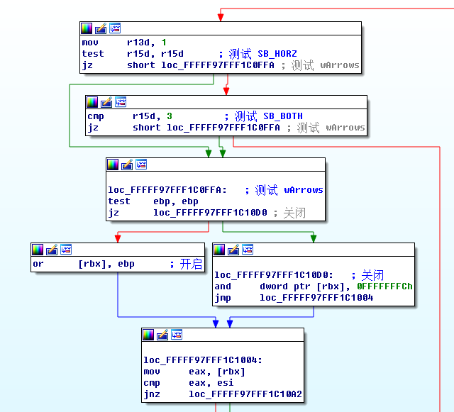

这个 BUG 存在于设置水平滚动条和垂直滚动条标志的时候。在刷新水平滚动条之后，一旦该滚动条对应的窗口在桌面上可见时，win32k!xxxEnableWndSBArrows() 函数将调用 win32k!xxxDrawScrollBar()，早先的文章中曾提到这可能触发一个潜在的用户模式回调。

在我们讨论用户模式回调前，继续讨论在调用 win32k!xxxDrawScrollBar() 之后将发生什么。这实际上和水平滚动条有相同的逻辑，仅仅有几个比特位的区别。如果我们选择关闭垂直滚动条，并假定我们触发了 UAF,那么这将会把 2 比特位写入到 tagSBINFO 堆块的某个地方。因此，如果原来的值是 0x2，现在就变成了 0xe。如下图所示。

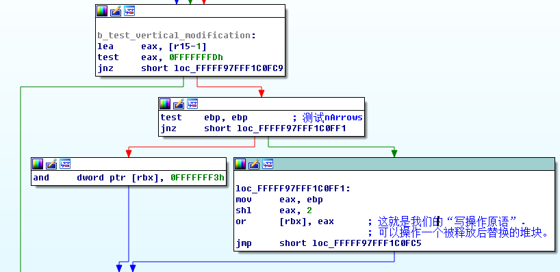

这一比特的改变足够导致最终的代码执行。我没有深究如何通过清除比特位是完成利用，但它是有可能的。

上面所述的重点是，为了同时能操作水平和垂直滚动条，必须以某种方式创建具有这两个元素的滚动条控件。这个通过调用 CreateWindow() 并设置 WS_HSCROLL 和 WS_VSCROLL 标志来实现。代码如下：

    g_hSBCtl = CreateWindowEx( 
        0,                  // No extended style 
        "SCROLLBAR",        // class 
        NULL,               // name 
        SBS_HORZ | WS_HSCROLL | WS_VSCROLL, // 垂直+水平 
        10,                 // x 
        10,                 // y 
        100,                // width 
        100,                // height 
        g_hSpray[UAFWND],   // 无模式父窗口 
        (HMENU)NULL,
        NULL,               // window owner 
        NULL                // extra params 
        );

可以通过下面的代码确保其可见（通常这是缺省的，这里显式调用一下）：

    result = ShowWindow(g_hSBCtl, SW_SHOW);

滚动条默认是开启的，当我们准备尝试触发漏洞代码时，我们可以设置为滚动条不可用，以便腐蚀我们需要的比特位：

    result = EnableScrollBar(g_hSBCtl, SB_CTL | SB_BOTH, ESB_DISABLE_BOTH);

## 触发漏洞

尽管我们上面描述了 BUG 的细节以及如何触发相关代码，但是我们依然忽略了最重要的步骤，就是拦截由 win32k!xxxDrawScrollBar() 发起的用户模式回调，以便我们能在 win32k!xxxEnableWndSBArrows() 继续执行前改变堆的内容。我们需要真正触发这个 BUG，但如果不了解任何 Win32k.sys 相关的的情况以及相关的API，就像我开始的样子，这对自己来说就是一次冒险。

先前的文章中有一个很好的调用栈的示意图，深入展示了这个过程，通过 win32k!xxxDrawScrollBar() 进行触发，然后 ClientLoadLibrary() 被调用，并且通过KeUserModeCallback() 进行派发处理。我们需要确实搞清楚 KeUserModeCallback() 的调用情况，以便我们在自己的进程中进行 HOOK。

我发现一些好的论文中或多或少提及了用户模式回调的相关资料。其中涉及到 win32k 的部分是非常有用的：

+ [https://media.blackhat.com/bh-us-11/Mandt/BH_US_11_Mandt_win32k_WP.pdf](https://media.blackhat.com/bh-us-11/Mandt/BH_US_11_Mandt_win32k_WP.pdf)(Tarjei的论文) 
+ [http://azimuthsecurity.com/resources/recon2012_mandt.pptx](http://azimuthsecurity.com/resources/recon2012_mandt.pptx) (Tarjei的PPT包含许多扩展信息) 
+ [http://www.nynaeve.net/?p=204](http://www.nynaeve.net/?p=204) 
+ [http://www.cprogramdevelop.com/3825874/](http://www.cprogramdevelop.com/3825874/)
+ [http://www.zer0mem.sk/?p=410](http://www.zer0mem.sk/?p=410) 
+ [https://www.reactos.org/wiki/Techwiki:RegisterUserApiHook ](https://www.reactos.org/wiki/Techwiki:RegisterUserApiHook )
+ [http://pasotech.altervista.org/windows_internals/Win32KSYS.pdf ](http://pasotech.altervista.org/windows_internals/Win32KSYS.pdf )
+ [http://j00ru.vexillium.org/?p=614 ](http://j00ru.vexillium.org/?p=614 )
+ [http://uninformed.org/index.cgi?v=10&a=2#SECTION00042000000000000000](http://uninformed.org/index.cgi?v=10&a=2#SECTION00042000000000000000)

通常，每个进程有一张用户模式回调函数的指针表，PEB->KernelCallBackTable 就指向这张表。当内核想调用用户模式函数时，它就把函数索引号传递给 KeUserModeCallBack()。在上面的例子中，索引号指向用户态的 __ClientLoadLibrary() 函数。

KeUserModeCallBack() 在 PEB->KernelCallBackTable 中根据索引查找相应函数并执行，最终在用户态调用 KiUserModeCallbackDispatch()。

为了 HOOK 指定的入口点，应当查找 PEB->KernelCallBackTable 中 __ClientLoadLibrary() 的索引，然后替换为我们自己的函数。值得注意的是，这个索引因操作系统版本而异，并和硬件平台相关。

如果我们想查看 PEB->KernelCallBackTable，可通过 WinDbg 找到这个表的地址。通过比较 32 位和 64 位平台，没有发现有太大的差异。

    kd> dt !_PEB @$peb 
    ntdll!_PEB 
        +0x000 InheritedAddressSpace : 0 '' 
        +0x001 ReadImageFileExecOptions : 0 '' 
        +0x002 BeingDebugged : 0 '' 
        +0x003 BitField : 0x8 '' 
        +0x003 ImageUsesLargePages : 0y0 
    [...] 
        +0x02c KernelCallbackTable : 0x76daf620 Void 
        
    kd> dds 0x76daf620 
    76daf620 76d96443 user32!__fnCOPYDATA 
    76daf624 76ddf0e4 user32!__fnCOPYGLOBALDATA 
    76daf628 76da736b user32!__fnDWORD 
    76daf62c 76d9d603 user32!__fnNCDESTROY 
    76daf630 76dc50f9 user32!__fnDWORDOPTINLPMSG 
    76daf634 76ddf1be user32!__fnINOUTDRAG 
    76daf638 76dc6cd0 user32!__fnGETTEXTLENGTHS 
    76daf63c 76ddf412 user32!__fnINCNTOUTSTRING
    76daf640 76d9ce49 user32!__fnINCNTOUTSTRINGNULL 
    [...] 
    76daf724 76da3962 user32!__ClientLoadLibrary 
    
    kd> ?? (0x76daf724-0x76daf620)/4 int 0n65

在上面的实例中，我们知道 __ClientLoadLibrary 的索引号是 65，这也是我们要 HOOK 的地方。HOOK 以后，我发现 __ClientLoadLibrary 被 win32k 的相关代码多次调用！首先要做的是，在我们触发感兴趣的的调用之前如何通知我们的 HOOK 代码，以便知道我们确实 HOOK 到了需要修改的地方。因此 HOOK 代码中用了一个全局变量进行标识，当这个标识置位时才做相关的操作。

现在有两个障碍：

1. 如果让原始的 __ClientLoadLibrary 正常执行，当在 win32k 中触发漏洞时，我发现流程没有落入到用户态。我没有深究这个，只是猜测可能是这个调用要加载的动态库已经被加载，因此它不再需要调用这个加载函数。为了使这个加载动作能够发生，我让 \_\_ClientLoadLibrary 的 HOOK 函数每次都不返回结果，从而强制它不断地尝试加载。我的工作仅仅是在参数结构中回送NULL，这是通过反转 user32.dll 中的 __ClientLoadLibrary() 函数来完成的。
2. EnableScrollBar() 的执行最终触发了 __ClientLoadLibrary，然后走到我们要通过 win32k!xxxDrawScrollBar() 进行利用的地方，因此必须知道我们感兴趣的东西出现之前这个调用的次数，通过一个计数，我能确切知道触发这个 BUG 并进入了 HOOK 代码。幸运的是，这个计数在各个平台和操作系统版本之间是固定不变的。

因此，HOOK 函数看起来如下面的形式：

    void ClientLoadLibraryHook(void * p) 
    { 
        CHAR Buf[PGSZ]; 
        memset(Buf, 0, sizeof(Buf)); 
        if (g_PwnFlag) 
        { 
            dprintf("[+] __ClientLoadLibrary hook called\n"); 
            if (++g_HookCount == 2) 
            {
                g_PwnFlag = 0;      // 仅仅执行一次.. 
                ReplaceScrollBarChunk(NULL); 
            }
        } 
        fpClientLoadLibrary(&Buf); // 调用原始函数
    }

一旦我们确定当前是从 win32k!xxxDrawScrollBar() 函数调用过来的，就可以尝试触发这个BUG。现在我们只考虑触发，只需要调用 DestroyWindow(g_hSBCtl) 就可以了。这将导致窗口的 tagSBINFO 结构被释放，而窗口结构本身不会被立即释放，因为它的引用计数仍然被原始调用所使用，但 tagSBINFO 没有这样的引用计数机制，因此被立即释放。

此时，我们已经触发了 BUG。尽管我们没有重新分配包含 tagSBINFO 的堆块，我们还是能写入表示 disable 的两比特到已经释放的堆上。下一步是拿我们想要的东西来替换这个已经释放的堆块，因此我们能做一些比设置几个比特位更有意思的事情。为此，我们需要了解一些桌面堆的背景知识。

## 桌面堆

win32k.sys 用桌面堆来存储与给定桌面相关的 GUI 对象。包括窗口对象及其相关结构，如属性列表、窗口文本、滚动条。[Tarjei的文章](https://media.blackhat.com/bh-us-11/Mandt/BH_US_11_Mandt_win32k_WP.pdf)提及到这个，但要特别注意，它实际上只是一个在用户态使用 RtlAllocateHeap() 和 RtlHeapFree() 进行操作的简化版后端分配器。桌面堆由一个 _HEAP 结构维护，由于没有前端分配器，因此没有堆碎片合并和旁视列表等东西。

每创建一个桌面就有一个相应的桌面堆为它服务。这意味着，我们能分配一个新的桌面以便得到一个“新鲜”的桌面堆，在这个堆上我们的操作更加有预见性。然而，这个对低完整性权限下的进程是没有意义的，因为，这样的进程不允许创建一个新的桌面。

现在主要的问题是追踪分配过程（后面将涵盖更多关于元数据等的细节）。

## 监控桌面堆的分配

为了释放桌面堆的分配和释放，我习惯使用 WinDbg 脚本：

64位堆监控

    ba e 1 nt!RtlFreeHeap ".printf\"RtlFreeHeap(%p, 0x%x, %p)\", @rcx, @edx, @r8; .echo ; gc";
    ba e 1 nt!RtlAllocateHeap "r @$t2 = @r8; r @$t3 = @rcx; gu; .printf \"RtlAllocateHeap(%p, 0x%x):\", @$t3, @$t2; r @rax; gc";

32位堆监控

    ba e 1 nt!RtlAllocateHeap "r @$t2 = poi(@esp+c); r @$t3 = poi(@esp+4); gu; .printf \"RtlAllocateHeap(%p, 0x%x):\", @$t3, @$t2; r @eax; gc"; 
    ba e 1 nt!RtlFreeHeap ".printf\"RtlFreeHeap(%p, 0x%x, %p)\", poi(@esp+4), poi(@esp+8), poi(@esp+c); .echo ; gc"

除了这些调试脚本，由于桌面堆仅仅是用户态后端分配器的简化形式，我们确实也可以用 WinDbg 自带的 !heap 命令。

## 挖坑

为了利用这个BUG，我们需要替换最近一次释放的 tagSBINFO 堆块，而且我们也知道如何利用这些典型的 BUG，那就是腐蚀临近的数据。这给我们提出基本的要求是在需要腐蚀的结构附近预先分配一些堆块。为了预测一个堆块被分配到什么位置，我们必须控制整个堆的布局（或者是尽可能）。为满足这个，可行的办法就是分配尽可能多的堆块，这样，新分配的堆块就是连续的。当我们需要一个坑的时候，我们就能在可预见的位置挖一个（通过释放已经分配的堆块）。

下面，简单了解一下影响分配的一些因素，上面的 WinDbg 脚本能帮助我们。Tarjei 在他关于win32k 的 PPT 中提及了在桌面堆上分配的主要对象，和我所看到的是完全一致的。这些是：

+ Window
+ Nenu
+ Hook
+ CallProcData
+ Input Context

桌面堆相当有趣，大多数的分配直接关联到窗口对象上去，并通过 tagWND 结构进行管理，这意味着我们想分配一个任意大小的堆块（所谓的小块填小坑），那么我们得先分配一个与之相关的窗口。你可以认为，窗口的结构就是堆分配的接口。另一点有意思的是，许多通过窗口操作分配的堆块不能立即被释放，除非窗口自己被销毁，这显然是有副作用的。最后，让我们设想我们通过窗口分配一个大小为N的堆块，正如上面例子中要做的，是否我们要分配很多大小为N的堆块？可以确定的是分配的的窗口结构无论大小都没有存储在链表中。因此，每个窗口可控制一个大小为N的堆分配。也就是说，如果你需要大量的大小为N的堆块，你必须先创建大量的窗口，用窗口来协助堆块分配。

在桌面堆上分配的还有三个重要的数据类型，我们可以通过窗口对象间接利用，以控制堆上的数据。我们大量使用这些数据类型来实现利用和构造堆风水。这三个数据类型是：

1. tagPROPLIST 结构：如果分配的足够小，就能填一些小坑。一个窗口对象包含一个tagPROPLIST，在 32 位系统是是 0x10 字节，64 位系统是是 0x18 字节。
2. 窗口文本：这是一个在桌面堆上分配的任意大小的 UNICODE 字符串，通过\_LARGE\_UNICODE\_STRING结构存储并嵌入到 tagWND 中。注意，strName 字段是一个结构，不是一个指针，但是该结构包含一个和窗口文本堆块相关的指针。
3. tagSBINFO 结构：漏洞的根源，包含 4 个或全部可控的成员字段。

图2展示了这些数据类型之间的相互关系：

为了初始化堆，我创建了大量 tagWND 结构（通过创建窗口对象）。这导致堆上形成许多大坑，也为我们分配其他需要的堆块提供了接口。在 win8 和 win8.1 上，分配一个新窗口导致一个 tagPROPLIST 结构被自动分配（可以通过前面提到的 WinDbg 脚本观察到）。在 win7 及其更早的版本上，我们则自己分配一个新的 tagPROPLIST，用来填一些小坑。

这里，我们喷射的所有窗口对象都没有窗口文本串，然而，如果需要的话，我们依然可以利用它分配或释放任意大小的堆块。一旦创建，你就不能移除已经存在的属性列表(proterty list)，除非窗口销毁，但是我们能控制这个列表的再分配，以容纳新的属性，这个机制可用来在先前的地方挖坑。而你需要做的仅仅是设置一个在原先列表中不存在的新属性（通过atomkey 区分）。

## 验证风水布局

有趣的是，桌面堆映射到了用户空间，虽然它是只读的。这意味着我们能验证我们构建的风水布局，并确保它正常运行。首先我们要确定桌面堆映射到用户态的什么位置。在 Tarjei 关于 [win32k](https://media.blackhat.com/bh-us-11/Mandt/BH_US_11_Mandt_win32k_WP.pdf) 的论文中提到了这个。PEB 中有一个未公开的结构 Win32ClientInfo 与之有关，其大致的定义如下：

    typedef struct _CLIENTINFO { 
        ULONG_PTR CI_flags; 
        ULONG_PTR cSpins; 
        DWORD dwExpWinVer; 
        DWORD dwCompatFlags; 
        DWORD dwCompatFlags2; 
        DWORD dwTIFlags; 
        PDESKTOPINFO pDeskInfo; 
        ULONG_PTR ulClientDelta; // 不完整. 参见 reactos 
    } CLIENTINFO, *PCLIENTINFO;

其中 PDESKTOPINFO 结构定义如下：

    typedef struct _DESKTOPINFO { 
        PVOID pvDesktopBase; 
        PVOID pvDesktopLimit;   // 不完整. 参见 reactos  
    } DESKTOPINFO, *PDESKTOPINFO;

第一个字段 pvDesktopBase 指向桌面堆的内核态地址，我们先记下。Win32ClientInfo 的 ulClientDelt 字段是一个内核态地址和用户态地址的差值， 通过这些信息就可以得到我们想要的了。

然而，我们不想自己解析堆结构，而是希望拥有一个 user32 句柄，就像 HWND 的值一样，能转换为用户态映射的地址，这样我们就能确定它是否关联到其他的堆分配。为了寻找这个句柄，我们需要找到一个叫 gShared 的结构，通常它位于 uer32.dll 中，在 win7 及其以后的版本中是被导出的，因此可以轻易找到它。

在大多数系统上这个结构是如下定义：

    kd> dt !tagSHAREDINFO 
    win32k!tagSHAREDINFO 
        +0x000 psi                  : Ptr32 tagSERVERINFO 
        +0x004 aheList              : Ptr32 _HANDLEENTRY 
        +0x008 HeEntrySize          : Uint4B 
        +0x00c pDispInfo            : Ptr32 tagDISPLAYINFO 
        +0x010 ulSharedDelta        : Uint4B 
        +0x014 awmControl           : [31] _WNDMSG 
        +0x10c DefWindowMsgs        : _WNDMSG 
        +0x114 DefWindowSpecMsgs    : _WNDMSG

在上面的结构中，aheList 指向一个句柄数组，并且，每个 _HANDLEENTRY 包含一个指向内核态地址的句柄。我们可以通过“内核态地址和用户态地址的差值”得到一个可用的用户态地址。不幸的是，这在 win7 之前的版本上是不可行的，因为 gSharedInfo 没有被导出。Tarjei 的文章上说，未公开函数 CsrClientConnectToServer 可被用来获取 gSharedInfo 的一个拷贝，但是我没有找到一个可行的例子。烦人的是，这个函数实现时需要的一个结构，其长度因系统不同而不同，因此，根据我的经验，你不能完全相信你在 ReactOS 中看到的。

一旦我们算出映射的位置，我们能构造一个函数，这个函数能告诉我们窗口对象在桌面堆上的位置。然后，如果我们想知道对应属性列表或文本串的堆块被分配到了什么位置，只需要解析用户态的结构就可以了。

## 用 tagPROPLIST 取代 tagSBINFO

现在，我们终于接近这个漏洞的利用了。我们已经有了控制堆块的方法、检验堆块位置是否正确的方法，而且也能触发这个 BUG，因此现在，我们能最终确定用选好的 tagPROPLIST 属性列表替换释放了的 tagSBINFO 堆块。注意，由于 tagPROPLIST 仅仅是一个大列表的头，因此我们可以让列表的大小和滚动条堆块的大小相匹配。tagPROPLIST 的后面部分基本上是一个 tagPROP 结构的数组，或叫做属性列表；因此，我将不区分数组和列表这个两个术语。tagPROPLIST 结构定义在 64 位系统上是这样的：

    kd> dt -b !tagPROPLIST 
    win32k!tagPROPLIST 
    +0x000 cEntries     : Uint4B 
    +0x004 iFirstFree   : Uint4B 
    +0x008 aprop        : tagPROP 
        +0x000 hData    : Ptr64 
        +0x008 atomKey  : Uint2B 
        +0x00a fs       : Uint2B

正如前面提到的，窗口对象有一个与之相关的属性列表。该列表通过 SetProp() 函数创建。它用于通过匹配 autoKey 来查找存在的属性，如果属性不存在，则在属性列表中创建一个新的属性项。如果根本就没有属性列表，则创建一个属性列表并连接到 tagWND 结构。

如果我们已经喷射了一个有 BUG 的 tagWND 并创建了相关的 tagPROPLIST 项，那么最终的布局如图3所示：

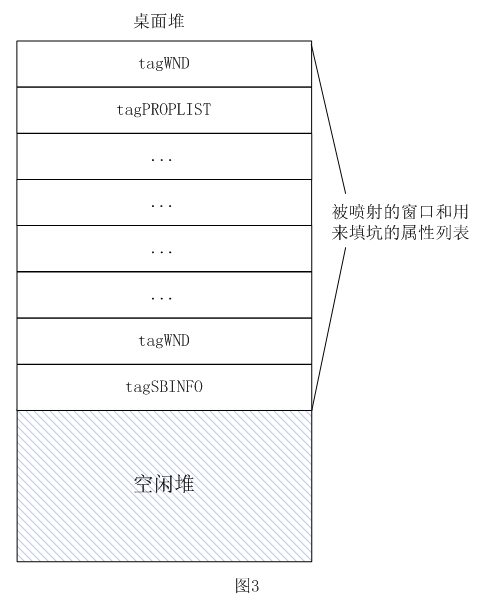

一旦这个设置好，我们就可以分配我们要利用的滚动条控件了。这将导致如图4所示结果：

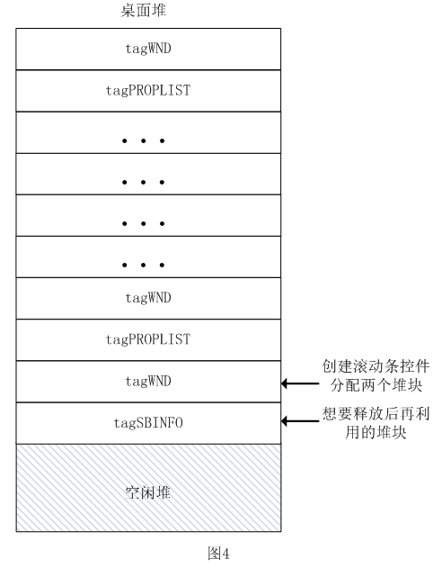

然后我们通过操作滚动条，触发用户模式回调的HOOK，在HOOK函数中，通过试图销毁窗口来释放 tagSBINFO 结构。这就导致图5的情形：

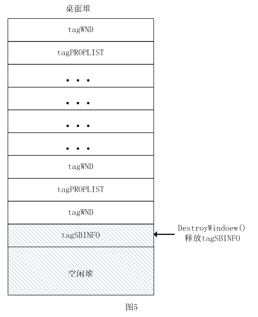

在 64 位下，tagSBINFO 结构是 0x28 字节，一个 tagPROPLIST 数组项是 0x18 字节，其中 0x10 字节是缺省的 tagPROP。因此，一个有两个数组项属性列表就是 0x28 字节（0x8 + 0x10 + 0x10），这真是天意无缝。假定我们已经喷射好了内存，以便我们填坑。我们仅仅需要一个拥有属性列表的窗口，在这个窗口释放了 tagSBINFO 结构（如前图所示）后立即为其增加一个新的属性列表项。这个过程是先释放先前的 0x18 字节的 tagPROPLIST 堆块，由于堆已经喷射过，所以前后附近都没有的空闲堆块，因此也不会出现堆块合并，也就没有足够大的空间容纳这新分配的 0x28 字节。这样，刚刚释放的 tagSBINFO 的位置就被拿来用了（其大小正好是0x28字节），这个情形如图6所示：

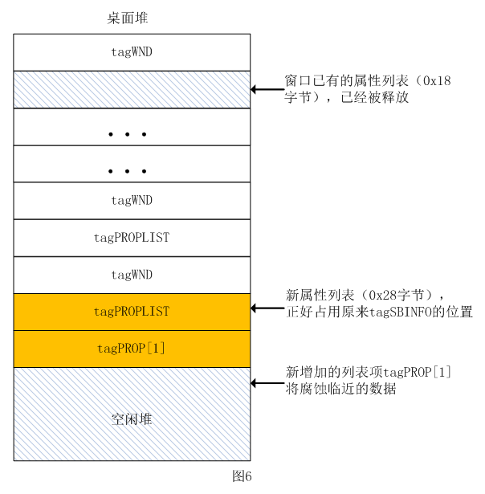

从我们 HOOK 的回调函数返回后，UAF 将被触发，几个比特位被写到 tagPROPLIST 中的 cEntries 字段上。原先的 cEntries 值是 0x2，表示我们创建了两个属性列表项。溢出后变成了0xe，第 3、4 位（从 1 开始数）被置为 1。

此时，我们完成了新堆的溢出，同时增加了这个属性列表的项数，项数大于 0xc。接下来我们将溢出临近的堆块，我们称之为阶段2腐蚀。

## 属性表滥用——阶段2腐蚀

在 Udi 的博客中就解释了这么多。在此之前这个被称之为“典型的堆溢出”，然而，根据我的经验，由这一点去实现任意地址读/写或代码执行是很困难的。我们再看 64 位上的 tagPROPLIST 结构：

    kd> dt -b !tagPROPLIST 
    win32k!tagPROPLIST 
    +0x000 cEntries     : Uint4B 
    +0x004 iFirstFree   : Uint4B 
    +0x008 aprop        : tagPROP 
        +0x000 hData    : Ptr64 
        +0x008 atomKey  : Uint2B 
        +0x00a fs       : Uint2B

阶段1的腐蚀让我们拥有了一个腐蚀了的 tagPROPLIST 数组，使得我们可增加数组项 tagPROP。tagPROPLIST 仅有两个字段：

+ cEntries：表示所拥有的列表项数量
+ iFirstFree: 表示第一个空闲项的索引号。一个满的列表项（表示需要申请一个新的了）就意味着 iFirstFree == cEntries。

当一个新的列表项插入到列表中时，某个函数先被调用来扫描每一个项，直到找到合适的 iFirstFree 索引值。如果找不到，则看是否 iFirstFree 的值大于 cEntries。如果 atomKey 对应的项不再列表中，就检查是否 iFirstFree != cEntries。如果不相等，就插入一项到 iFirstFree 索引的位置，如果相等，就分配一个新的能容纳所插入的属性列表，同时原有的项被复制过来，并且新的项被插入。

atomKey 字段对应的是 LPCTSTR lpString。正如 MSDN 中 SetProp() 文档中所述，调用者可传递一个字符串指针或一个 16 位的 atom 值。当传递字符串指针时，在存入属性列表之前将被自动转换为 atom 值。因为我们能传递任意 atom 值给 SetProp() 函数，这也使我们具备了控制这两个字节的能力，但是还有一些约束条件。那就是我们对 atomKey 的腐蚀数据不能重复，否则当设置一个新的属性项时，它将替换原有的具有相同 atom 值的属性项。另外，fs 字段我们不可控，其值为 0 表示 atomKey 的值 < 0xBFFF，它符合整形 atom 值。fs 字段的值为 2 时表示 atomKey 的值 >= 0xC000。

另一个需要注意的是，tagPROP 仅仅有 0xc 字节。这个结构在 64 位系统上以 0x10 字节对齐，因此当插入一个 tagPROP 项时就有额外的4字节不能被腐蚀。最后一个重要的点是，一个 tagPROPLIST 的堆块开始的 8 字节数据定义了列表项的大小，这意味着每个新插入的 tagPROP 项将总是写到 8 字节对齐的位置。

对每一个插入的 tagPROP，在 64 位系统上情况是这样的：

    * Offset 0x0: 8 字节任意可控的数据(hData) 
    * Offset 0x8: 2 字节多数可控的数据 (atomKey) 
    * Offset 0xa: 2 字节不可控的数据 (fs) 
    * Offset 0xc: 4 字节不能修改的数据 (padding)

这个情况比 2 比特位要好的多，但是仍然不完美。除非我们能用开始的 8 字节覆盖一些东西，这 8 字节来自完全可控的 hData 字段，否则将很受限制。如果我们需要写相邻结构中更深的字段，则不能避免某些值的不可控腐蚀。我花费一些时间在桌面堆上寻找各种对象，考虑前面的腐蚀限制，要绕过这个限制实现任意地址读写，我能想到的唯一办法是腐蚀 tagWND 的 strName 字段，这是一个 \_LARGE\_UNICODE\_STRING 的结构：

    kd> dt !_LARGE_UNICODE_STRING 
    win32k!_LARGE_UNICODE_STRING 
        +0x000 Length           : Uint4B 
        +0x004 MaximumLength    : Pos 0, 31 Bits 
        +0x004 bAnsi            : Pos 31, 1 Bit 
        +0x008 Buffer           : Ptr64 Uint2B

如果能腐蚀这个结构的 Buffer 字段，我们就能通过操作窗口文本实现从给定的地址读写 MaximumLength 个字节。这就是我要做的。你可能在前的章节中注意到这个结构，那是关于如何在桌面堆上创建一个任意大小和数值堆块，因此相同的情况可以应用到这里。

到现在，我们知道了如何用 tagPROPLIST 列表项来腐蚀数据，也知道哪些部分我们能控制，更重要的是知道我们将面临哪些的限制，这在 32 位和 64 位上是有区别的。我们先前在 64 位上所做的事情在 32 位上是不能工作的。接下来很快要做的是从阶段2腐蚀（也就是通过 tagPROP 结构写数据）转向另一个腐蚀“操作原语”，通过它我们能写入完全可控的数据，这就是我所指的阶段3腐蚀。

## 构造一个“读/写操作原语”——阶段3腐蚀

### 64位

目标计划是腐蚀相邻的 tagWND 中的 strName 字段。我们已经知道它是一个  \_LARGE\_UNICODE\_STRING 结构，但是让我们看一下 tagWND 结构更多的细节，看上去是这样的：

    kd> dt !tagWND 
    win32k!tagWND 
        +0x000 head                     : _THRDESKHEAD 
        +0x028 state                    : Uint4B 
        +0x028 bHasMeun                 : Pos 0, 1 Bit 
        +0x028 bHasVerticalScrollbar    : Pos 1, 1 Bit 
        +0x028 bHasHorizontalScrollbar  : Pos 2, 1 Bit 
    [SNIPPED FLAGS] 
        +0x028 bDestroyed               : Pos 31, 1 Bit 
        +0x02c state2                   : Uint4B [SNIPPED FLAGS] 
        +0x02c bWMCreateMsgProcessed    : Pos 31, 1 Bit 
        +0x030 ExStyle                  : Uint4B 
        +0x030 bWS_EX_DLGMODALFRAME     : Pos 0, 1 Bit 
        +0x030 bUnused1                 : Pos 1, 1 Bit 
        +0x030 bWS_EX_NOPARENTNOTIFY    : Pos 2, 1 Bit 
    [SNIPPED FLAGS] 
        +0x030 bUIStateFocusRectHidden  : Pos 31, 1 Bit 
        +0x034 style                    : Uint4B 
        +0x034 bReserved1               : Pos 0, 16 Bits 
    [SNIPPED FLAGS] 
        +0x034 bWS_POPUP                : Pos 31, 1 Bit 
        +0x038 hModule                  : Ptr64 Void 
        +0x040 hMod16                   : Uint2B 
        +0x042 fnid                     : Uint2B 
        +0x048 spwndNext                : Ptr64 tagWND 
        +0x050 spwndPrev                : Ptr64 tagWND 
        +0x058 spwndParent              : Ptr64 tagWND 
        +0x060 spwndChild               : Ptr64 tagWND
        +0x068 spwndOwner               : Ptr64 tagWND 
        +0x070 rcWindow                 : tagRECT 
        +0x080 rcClient                 : tagRECT 
        +0x090 lpfnWndProc              : Ptr64 int64 
        +0x098 pcls                     : Ptr64 tagCLS 
        +0x0a0 hrgnUpdate               : Ptr64 HRGN__ 
        +0x0a8 ppropList                : Ptr64 tagPROPLIST 
        +0x0b0 pSBInfo                  : Ptr64 tagSBINFO 
        +0x0b8 spmenuSys                : Ptr64 tagMENU 
        +0x0c0 spmenu                   : Ptr64 tagMENU 
        +0x0c8 hrgnClip                 : Ptr64 HRGN__ 
        +0x0d0 hrgnNewFrame             : Ptr64 HRGN__ 
        +0x0d8 strName                  : _LARGE_UNICODE_STRING 
        +0x0e8 cbwndExtra               : Int4B 
        +0x0f0 spwndLastActive          : Ptr64 tagWND 
        +0x0f8 hImc                     : Ptr64 HIMC__ 
        +0x100 dwUserData               : Uint8B 
        +0x108 pActCtx                  : Ptr64 _ACTIVATION_CONTEXT 
        +0x110 pTransform               : Ptr64 _D3DMATRIX 
        +0x118 spwndClipboardListenerNext : Ptr64 tagWND 
        +0x120 ExStyle2                 : Uint4B 
        +0x120 bClipboardListener       : Pos 0, 1 Bit 
    [SNIPPED FLAGS] 
        +0x120 bChildNoActivate         : Pos 11, 1 Bit

上面是 64 位下的结构，可以看到我们想覆盖的 \_LARGE\_UNICODE\_STRING 结构偏移是0xd8。你也将注意到在这个结构开始部分的一个重要字段。我原本希望能尽情蹂躏一下它，但是在 _THRDESKHEAD 中有大量的指针，这需要我们保持清醒，而且不幸的是，我们不能控制我们要写的地方，限制的原因我们在前面已经讨论过了。

_THRDESKHEAD 结构定义：

    kd> dt !_THRDESKHEAD 
    win32k!_THRDESKHEAD 
        +0x000 h        : Ptr64 Void 
        +0x008 cLockObj : Uint4B 
        +0x010 pti      : Ptr64 tagTHREADINFO 
        +0x018 rpdesk   : Ptr64 tagDESKTOP 
        +0x020 pSelf    : Ptr64 UChar

_THRDESKHEAD 的问题不仅使我们疑惑，也让我们重新审视那个对齐的约束条件。新的 tagPROP 列表项无论在任何偏移，我们的写入操作将直接覆盖 \_LARGE\_UNICODE\_STRING 开始的位置：

    win32k!_LARGE_UNICODE_STRING 
        +0x000 Length           <-- hData (完全可控) 覆盖这里 
        +0x004 MaximumLength    <-- 和这里 
        +0x004 bAnsi            <-- 和这里 
        +0x008 Buffer           <-- atomKey and fs (部分可控) 覆盖这里

很明确，我们想覆盖 Buffer 指针以便能访问任意地址的内存，然而，即使我们能安全地攻击这个结构的其他字段，也不能控制我们需要的指针。

我们不能腐蚀任意数据，这个问题的解决不再是 tagPROPLIST 的腐蚀问题了，而是变成了另外的完全不同的一套腐蚀机制。

在 windows xp 以后的版本中，用户模式后端分配器（如内内核桌面堆）的堆块头（也就是 \_HEAP\_ENTRY）存储存储在堆上，并位于该块的实际内容之前。桌面堆本身通过 _HEAP 结构来管理它，这个使我们在利用这个堆块时有一定的自由。

\_HEAP\_ENTRY结构定义如下：

    kd> dt !_HEAP_ENTRY 
    ntdll!_HEAP_ENTRY 
        +0x000 PreviousBlockPrivateData : Ptr64 Void 
        +0x008 Size             : Uint2B 
        +0x00a Flags            : UChar 
        +0x00b SmallTagIndex    : UChar 
        +0x00c PreviousSize     : Uint2B 
        +0x00e SegmentOffset    : UChar 
        +0x00f UnusedBytes      : UChar

堆块头总共 0x10 字节，前 8 字节是 PreviousBlockPrivateData，当请求的大小超过正常的 0x10（小于 8 字节按 8 字节对齐）时，用来容纳以前的实际块数据。这个在[Leviathan blog entry](https://www.leviathansecurity.com/blog/understanding-the-windows-allocator-a-redux/)中有简短的描述，此外早期关于用户模式堆的文章中也有描述。Size 和 PreviousSize 表示当前块大小和前一个块的大小，单位是 0x10 字节。Flags 表明该块是否空闲，等等。如果在 _HEAP 中开启 \_HEAP\_ENTRY 的安全模式，那么 SmallTagIndex 将包含块中数据的异或校验和。

尽管对齐限制对我们不利，但它确实是存在的。如果你调用 tagPROPLIST 总是至少 0x18 字节，然后增加 0x10 字节的 tagPROP。对于一个 0x28 字节有两个列表项的 tagPROPLIST，将被放置到 0x20 字节的堆块中，且 PreviousBlockPrivateData 表示的多出来的字节使用相邻的堆块。这意味着当我们增加第三个列表项的时候，相邻的堆块就被腐蚀了，可控的 8 字节的 hData 将覆盖 \_HEAP\_ENTRY 的顶部。

我们想做的是利用这个，以便能以某种方式写任意数据到 Buffer 的顶部位置。首先，我们改动堆布局，以便接近我们腐蚀过的 tagPROPLIST 堆块，在控制过程中，我们有一个小的堆块包含了一个窗口相关从文本串，我们称这个为“覆盖堆块”。毗邻这个“覆盖堆块”，我们放置一个 tagWND ，以便我们腐蚀这个 tagWND。下面图7说明这个过程。注意，我们开始省略了先前喷射的堆块，以节省篇幅，因此这些现在应该被视为隐含的。

接下来，我们插入第三个 tagPROP 到 tagPROPLIST 的列表中，它将覆盖 \_HEAP\_ENTRY 的最后 8 字节，并且前 8 字节无论是什么都在“覆盖堆块”中。当我们修改 \_HEAP\_ENTRY，修改“覆盖堆块”的大小超过其实际大小，并使其足够容纳临近的 tagWND 结构。

现在释放刚才被腐蚀的“覆盖堆块”，以便使堆管理器把它放置到空闲列表中，该列表对应的块大小（每个空闲列表对应一个固定size）大于“覆盖堆块”的实际大小。然后通过修改窗口文本（我们可以完全控制）重用这个块。然而这会有一个小问题需要我们解决。当“覆盖堆块”被释放时，堆管理器试图查找前一个临近的块，这取决于被腐蚀的 Size 字段。堆管理器查看这个临近的块是否是空闲的，以便合并它。无论如何引用我们都想控制它，并且设置一个正在使用的标识。稍微修改一下我们的堆布局就可以实现这个。此时，我们放置一个假的堆块，该堆块的堆头被设置了“在用”标志，而且其 PreviousSize 值设置为腐蚀过的 Size 字段的值，这样我们就能通过分配另外一个窗口的窗口文本来简单实现。新的堆布局如下（图8）：

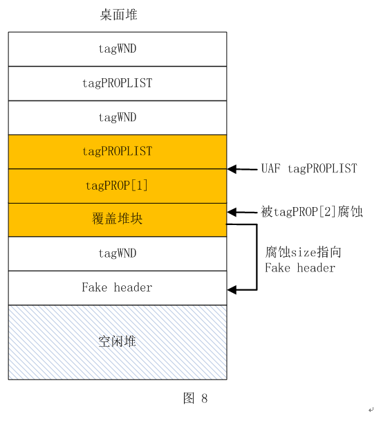

现在我们可以释放被腐蚀的“覆盖堆块”了，方法是更新与之相关的窗口的文本串，使其长度大于原来的 0x10 字节。这样，被腐蚀的“覆盖堆块”先被释放，并放置的空闲列表中，然而其大小是被腐蚀过的，其宣称的大小要比实际的大。这个大小可以根据我们是实际需要进行调整。这样我们的字符串数据就被写到了这个“覆盖堆块”，然后我们用这个“覆盖堆块”来把临近的 tagWND 腐蚀成任意数据。如下（图9）：

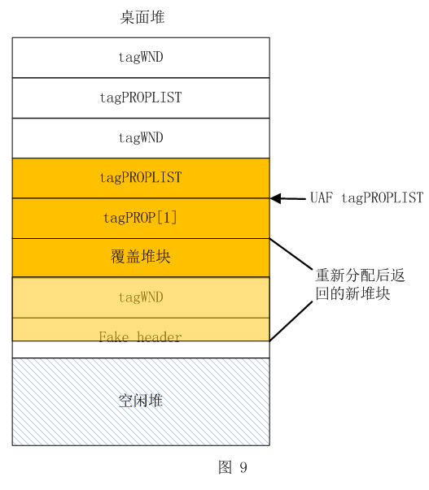

这就是阶段3的腐蚀。现在我们能用任何想要的数据覆盖 strName.Buffer 的指针。然而，腐蚀 tagWND 的其他数据依然有一些麻烦，但这不是问题，因为桌面堆被映射到了用户空间！因此在腐蚀所有东西之前，我们就读取了 tagWND 的所有内容，修改 strName 结构的内容为我们想要的，并且通过修改窗口文本发送了所有数据。

通过 strName 不仅让我们有了任意读写的“操作原语”，并且可以重复修改 strName，这是窗口文本的修改机制所允许的。只要写入的字符串长度不大于 MaximumLength 的值，就可以继续使用同一个堆块。因此，每次我们想修改 strName 的地址来读取某处的值，就用一个新字符串附并加我们的数据去更新那个“覆盖堆块”。这个复用如图 10 所示。注意，我再次放大了图的鸟瞰粒度，以便详细展示每一次腐蚀。

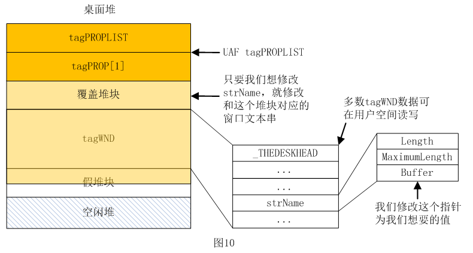

这意味着我们最终仅需腐蚀两个额外的东西（除了原先的 tagPROPLIST 列表项）：

1. “覆盖堆块”的头。我们能在腐蚀之前读取这个，因此，我们知道如何在用完后恢复它。很有趣的是，我们甚至能修复第三个 tagPROPLIST 列表项的堆块，只需把我们用来腐蚀的 atomKey 送到原先的位置！
2. strName 结构，我们能通过写入窗口文本轻易修改。操作时需要把返回值设置为空。

现在，如果我们要从内存的某处读取一些字节，我们就通过[InternalGetWindowText()](https://msdn.microsoft.com/en-us/library/windows/desktop/ms633523(v=vs.85).aspx)函数查询窗口文本，那里有被腐蚀的 strName 的人口。我们能读取Length 字段所声明的字节数。同样地，如果我们想写内存中的任意位置，就用 NtUserDefSetText() 函数更新被腐蚀的窗口文本，但写入数量应不大于 MaximumLength 字段声明的值（这个值也是我们可设置的）。这样已有的buffer被复用，并指向我们想要的内存地址。

#### Windows 8 和 8.1 的堆编码

尽管从[Windows Vista](https://blogs.technet.microsoft.com/srd/2009/08/04/preventing-the-exploitation-of-user-mode-heap-corruption-vulnerabilities/)开始，用户态的后端分配器使用了堆编码（heap encoding）,但桌面堆从来不开启它，直到 Windows 8 以后。因此在 Windows 8 以后的系统上，当我们进行“覆盖堆块”的覆盖时就产生了一个障碍。然而事实上，用来容纳堆的 _HEAP 结构中包含了这个 cookie，并用它来编码整个堆头，因此，我们能从映射到用户态的桌面堆中读取这个 cookie，然后用它对“覆盖堆块”的头进行编码，编码方法通过分配器代码的逆向得到，模仿它的操作，分配器是可以接受这个操作的。

### 32位系统

首先要注意的是，32 位系统的 tagPROP 结构是 8 字节，而不是 64 位系统上 0xc 字节，并且我们控制的 hData 字段仅有 4 字节，而不是 64 位系统上 8 字节。同时也没有多余的补齐字节，64 位系统上有 8 字节的补齐，因此整个结构正好是 8 字节。这意味着我们不能完全腐蚀临近的堆块头，如果我们只能部分控制数据的话。在某些版本的 Windows 上是可以的，因为我们能控制最重要的字段，但是在 Windows 8 和 8.1 上堆头是被编码的，我们最终能通过 fs 字段不安全地覆盖堆头的一部分。32 位系统的 \_HEAP\_ENTRY 头看上去相似，但是缺少了 PreviousBlockPrivateData 字段。

我们仍然不能腐蚀 tagWND 的所有部分，因为无法避免截断的指针。并且我仍然没有找到一个对象能满足这个，鉴于 \_LARGE\_UNICODE\_STRING 在 64 位系统上良好运行，我想在 32 位系统上也用它。

我的想法是，如果我们能通过增加索引值的方法来腐蚀 tagPROPLIST 结构的 iFirstFree 字段（属性列表中第一个被释放的属性项的索引），那么就能使其指向堆上更远的位置。例如，我们能把他指向 tagWND.strName 的顶部。图11展示了这个想法：

为了过程清晰，我们现在采用两个 tagPROPLIST 结构，分别是用于 UAF 的“属性列A”，和另一个“属性列B”。我们需要确切知道被插入到了“属性列A”的 tagPROP 的哪些部分将覆盖“属性列B”的 iFirstFree 字段。我们也必须牢记一次只能写 8 字节，因此我们必须至少插入一个多余的 tagPROP 到“属性列A”中去，第一次腐蚀临近堆头，第二次命中“属性列B”的 tagPROPLIST 字段。这些可能根据不同的操作系统和不同的堆块大小而变动，而且在我的利用中必须适应各种堆的布局。图12展示了我们如何腐蚀。注意，图中第一个 tagPROPLIST 没有拆分成独立的字段，因此 tagPROP[0] 是隐含的。然而第二个 tagPROPLIST 中，为拆分出其内部成员以便展示我们的腐蚀过程。这就是为什么 tagPROP[0] 会被显示：

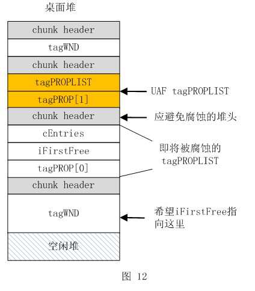

首先我们注意，如果我们对每个 tagPROP 写 8 字节，那就意味着我们仅能部分控制对 iFirstFree 的覆盖（由于它来自 atomKey 和 fs 字段），这是我们最关心的。因为我们能通过 atomKey 的值来完全控制至少两个关键的字节，当这个值足够小时，fs 字段将变成 0。因此我们用 hData 的值覆盖 cEntries 为合理的值，并利用 atomKey 使 iFirstFree 指向 tagWND，我们要覆盖的 strName.Buffer 指针就在 tagWND 中。如果我们不能直接覆盖 Length 和 MaximumLength 的值，那么我们可以预先分配一个字符串给目标窗口，以确保其长度是已经被设置好的某个值。

让我们看看 32 位的 tagWND 结构，看能得到什么。注意，这次我用 -b 参数，以便我们能方便地计算 strName 中 Nuffer 的偏移。

    kd> dt -b !tagWND 
    win32k!tagWND 
        +0x000 head         : _THRDESKHEAD 
            +0x000 h        : Ptr32 
            +0x004 cLockObj : Uint4B 
            +0x008 pti      : Ptr32 
            +0x00c rpdesk   : Ptr32 
            +0x010 pSelf    : Ptr32 
        +0x014 state        : Uint4B 
        +0x014 bHasMeun     : Pos 0, 1 Bit 
    [SNIPPED FLAGS] 
        +0x014 bDestroyed   : Pos 31, 1 Bit 
        +0x018 state2       : Uint4B 
    [SNIPPED FLAGS] 
        +0x018 bWMCreateMsgProcessed    : Pos 31, 1 Bit 
        +0x01c ExStyle                  : Uint4B 
        +0x01c bWS_EX_DLGMODALFRAME     : Pos 0, 1 Bit 
    [SNIPPED FLAGS] 
        +0x01c bUIStateFocusRectHidden  : Pos 31, 1 Bit 
        +0x020 style        : Uint4B 
        +0x020 bReserved1   : Pos 0, 16 Bits 
    [SNIPPED FLAGS] 
        +0x020 bWS_POPUP    : Pos 31, 1 Bit 
        +0x024 hModule      : Ptr32 
        +0x028 hMod16       : Uint2B 
        +0x02a fnid         : Uint2B 
        +0x02c spwndNext    : Ptr32 
        +0x030 spwndPrev    : Ptr32 
        +0x034 spwndParent  : Ptr32 
        +0x038 spwndChild   : Ptr32 
        +0x03c spwndOwner   : Ptr32 
        +0x040 rcWindow     : tagRECT 
            +0x000 left     : Int4B 
            +0x004 top      : Int4B 
            +0x008 right    : Int4B 
            +0x00c bottom   : Int4B 
        +0x050 rcClient     : tagRECT 
            +0x000 left     : Int4B
            +0x004 top      : Int4B 
            +0x008 right    : Int4B 
            +0x00c bottom   : Int4B 
        +0x060 lpfnWndProc  : Ptr32 
        +0x064 pcls         : Ptr32 
        +0x068 hrgnUpdate   : Ptr32 
        +0x06c ppropList    : Ptr32 
        +0x070 pSBInfo      : Ptr32 
        +0x074 spmenuSys    : Ptr32 
        +0x078 spmenu       : Ptr32 
        +0x07c hrgnClip     : Ptr32 
        +0x080 hrgnNewFrame : Ptr32 
        +0x084 strName      : _LARGE_UNICODE_STRING 
            +0x000 Length   : Uint4B 
            +0x004 MaximumLength : Pos 0, 31 Bits 
            +0x004 bAnsi    : Pos 31, 1 Bit 
            +0x008 Buffer   : Ptr32 
        +0x090 cbwndExtra   : Int4B 
        +0x094 spwndLastActive  : Ptr32 
        +0x098 hImc         : Ptr32 
        +0x09c dwUserData   : Uint4B 
        +0x0a0 pActCtx      : Ptr32 
        +0x0a4 pTransform   : Ptr32 
        +0x0a8 spwndClipboardListenerNext   : Ptr32 
        +0x0ac ExStyle2                     : Uint4B 
        +0x0ac bClipboardListener           : Pos 0, 1 Bit 
    [SNIPPED FLAGS] 
        +0x0ac bChildNoActivate             : Pos 11, 1 Bit

strName 的偏移是 0x84，Buffer的偏移是 0x8c。要知道我们有 tagPROP 列表项的索引，也要知道我们能写 8 字节。因此我们能轻易知道，iFirstFree 是否索引到 MaximumLength 指向的窗口的 0x88 偏移地址。由于只能控制 Buffer 的两个字节，因此写操作不可行，鉴于我们的目标是把这个作为我们任意读写的“操作原语”，因此这个结果是不能接受的。如果我们写下一个索引使其指向 0x90，那么我们将覆盖 cbwndExtra，这不是我们所追求的。

回顾先前做堆风水时我们所能控制的东西，然后看看 tagWND 中是否有我们可控制的、有趣的偏移地址。在 tagWND 中偏移 0x70 的地方是 pSBInfo 字段。这个偏移可以被 8 整除，因此我们能用假 tagPROP 中 hData 的部分数据覆盖这个指针。

我们能否覆盖 pSBInfo 使其直接指向同一个 tggWND 结构中的 strName 呢？或许能用 scrollbar 的 API 去腐蚀 strName 以达到我们的目的。

pSBInfo 指向一个 tagSBINFO 结构，这个结构在最开始的 UAF 过程中提到过。

    kd> dt -b !tagSBINFO 
    win32k!tagSBINFO 
        +0x000 WSBflags     : Int4B 
        +0x004 Horz         : tagSBDATA 
            +0x000 posMin   : Int4B 
            +0x004 posMax   : Int4B 
            +0x008 page     : Int4B 
            +0x00c pos      : Int4B 
        +0x014 Vert         : tagSBDATA 
            +0x000 posMin   : Int4B 
            +0x004 posMax   : Int4B 
            +0x008 page     : Int4B 
            +0x00c pos      : Int4B

我们记得，WSBflags 不能给我们更多的控制，但是我们至少知道，当启用滚动条时它被置 1，当关闭滚动条时它被设置为 0。这个标志字段不能设置为任意值，通过逆向相关的功能函数，我们发现，如果不改变滚动条的状态，这个表示字段就不变。tagSBDATA 结构中的取值似乎更有趣。如果我们阅读 [SetScrollInfo()](https://msdn.microsoft.com/en-us/library/windows/desktop/bb787595%28v=vs.85%29.aspx) 的文档，就能很好的理解这些取值的含义。看上去我们能通过 [SCROLLINFO](https://msdn.microsoft.com/en-us/library/windows/desktop/bb787537(v=vs.85).aspx) 结构给 SetScrollInfo() 设置参数。只要我们要腐蚀的窗口附近有一个滚动条控件，我们就能直接操作 pSBInfo 的指针（它将发送一个特殊的窗口消息给关联的[窗口控件](https://msdn.microsoft.com/en-us/library/windows/desktop/bb787529(v=vs.85).aspx)）。显然我们能无条件地控制 posMin 和 posMax 的值。page 和 pop 字段有一点小麻烦，由于它们被限制在一定范围内，现在我们试图避免这些。给 SCROLLINFO 结构设置 SIF\_RANGE 标志，以声明我们想在哪里设置最大和最小值。

我们想用任意数据覆盖 Buffer，这意味着我们想让 posMin 覆盖它，因此我们能覆盖 pSBInfo 使其指向 strName.MaximumLength。只要我们不启用或停用滚动条，WSBflags 字段就不会被改写，这就保证了 strName.MaximumLength 的完整性。这意味着无论我们如何设置 posMin （通过 SCROLLINFO 的 nMin）都将改写 Buffer，而且 posMax 将被写到 cbwndExtra 上去。这不是一个大问题；在 64 位系统上，我们能预先读取这个值并在之后恢复它。溢出的通用思路如图13所示：

现在我们用图 14 说明 32 位系统下的攻击过程。在我们腐蚀任何远离UAF的地址之前，首先退一步看看图中相关的堆块和堆的布局。现在我们知道了更多的细节，接下来要做的事情就显而易见了。

接下来，插入两个属性项到“属性列A”，这将腐蚀“属性列A”附近的数据，这得益于前面的 UAF 腐蚀，同时使 “属性列A”的 iFirstFree 指向 pSBInfo。注意，这也将腐蚀附近的 pSBInfo 值，但是我们可以预先读取它，以便在腐蚀后恢复它。

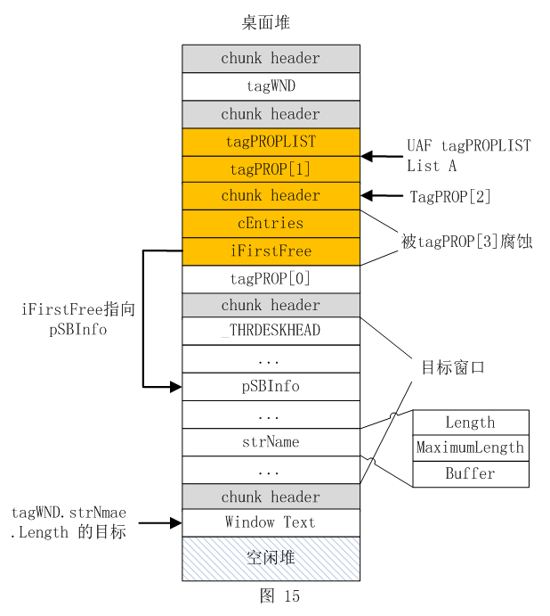

我们在“属性列B”中插入一个新的 tagPROP，该 tagPROP 的 atom 标识符和列表中已有的不同，这样该 tagPROP 就被插入到下一个空闲的索引项上。从而使 pSBInfo 被腐蚀，使其指向同一个 tagWND 中的 strName.MaximumLength。

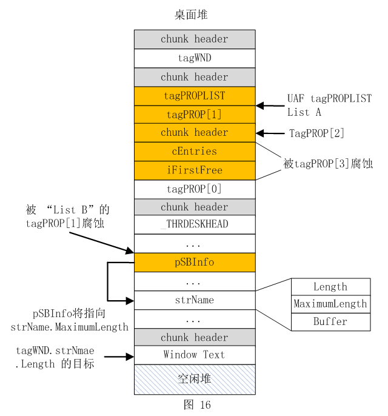

最后，刷新滚动条来腐蚀 strName.Buffer 字段（如图17）：

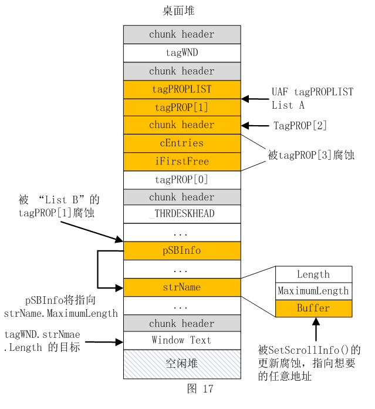

要知道，与 64 位的情况不同，我们不能腐蚀 strName 的长度值。我们可以预先分配一个长度合适的窗口文本串，以便其值是已经在用。之后，无论我们是想从内核地址读还是写一些数据，只需要调用 SetScrollInfo() 操作目标窗口更新 Buffer 的值，然后再使用窗口文本的 API 进行操作。

现在我们在 32 位系统上有了可重复利用的任意地址读写的“操作原语”！

## 代码执行

一切从现在开始，假定我们有一个任意读/写的“操作原语”（primitive）。因此，当我说泄漏/读取某值或改写某值时，就是指执行这个在之前的腐蚀阶段建立的“操作原语”。这个“操作原语”在两个平台上是大致相同的。剩下的要做的仅仅是改写一个函数指针并且是其指向某处的 ShellCode 载荷。通用的方法是覆盖 nt!HalDispatchTable 的第二项，它所对应的是 HalQuerySystemInformation() 函数。然后在用户态调用 NtQueryInternalProfile() 函数触发它。

我们需要知道内核模块的加载基址，以便计算 nt!HalDispatchTable 的内核地址。为此，我们可以在用户态调用 NtQuerySystemInformation() 来获取模块信息，这些信息中就包含模块基址。

    // 枚举值 11 代表 SystemModuleInformation , 这是未文档化的... 
    rc = NtQuerySystemInformation((SYSTEM_INFORMATION_CLASS)11, pModuleInfo, 0x100000, NULL);

之后，我们在用户态加载 ntoskrnl.exe 来寻找 nt!HalDispatchTable 的偏移，这样就能得到其内核空间的地址。接着用“读操作原语”来读取 aliQuerySystemInformation() 的内核地址（该函数是未导出的）以便修改它，然后用“写操作原语”腐蚀该函数的指针，使其指向 shellcode 的地址（可能是内核地址空间或用户地址空间，后面详述）。其读写的字节数在 32 位和 64 位系统上是一样的。

## 绕过 SMEP

Windows 8 和 8.1 引入了对 SMEP 的支持，而且一些安全产品也可在 Windows 7 上开启它，因此我们假定它是一定存在的。SMEP 阻止我们在用户空间以内核权限执行代码，这使得修改 nt!HalDispatchTable 的列表项，使其指向用户空间地址变得不可用了。因此，我们希望其指向内核空间的的某个可控制的位置，在该位置上的代码能修改 cr4 寄存器的值以关闭 SMEP，这样我们就能跳转的用户地址空间了。[MWR的文章](https://labs.mwrinfosecurity.com/blog/windows-8-kernel-memory-protections-bypass/) 中介绍了一个有趣的 64 位下的技巧，通过自己映射页表项，对任意虚拟地址能得到一个对应的内核态有效地址。然后通过“写操作原语”直接修改页表项并修改其掩码位。我把这个技巧移植到 32 位系统上来，但是开启 PAE 和未开启 PAE 的系统有一些不同。

要实现这个，显而易见的方法是映射一个用户态的地址到内核空间，然后用“写操作原语”使页表项具有系统权限而不是用户权限。这是我们第一步要做的。当我在 Windows 8 上实现的时候我遇到了一个有趣的问题。Windows 8 及其之后的桌面管理器(dwm.exe)定期扫描桌面上的窗口并且查询他们的名称，具体什么原因我没有调查。这个操作也没有给窗口发送消息，但是却有一个对应的窗口处理函数，并且函数中调用了 GetInternalWindowText()。因此，问题是要利用窗口结构的 strName 的字段去改写包含 shellcode 的内存页表项，这块内存属于我们自己的进程空间的页表。当 dwm.exe 从内核中获取窗口名称的时候，修改过的页表项导致内核检查 strName.Buffer 是否为空，从而间接引用该地址，该地址无效将导致系统崩溃。

为了满足 dwm.exe 的查询，我使用了一个内核地址做为载荷。这样，无论当前进程如何加载任何东西，与该地址相关的页表项总都是有效。我选择把它放置到桌面堆上，因为我们能通过前面提到的方法计算出它的内核地址。我们仍然通过自己映射页表项的方法，此时页表已经被标识为高权限，但没有被标识为可执行。因此我们要做的只是设置执行位。

步骤如下：

1. 创建一个窗口文本的缓冲区，包含我们阶段1中的载荷，并计算其内核地址。
2. 利用“自己映射页表项”的技巧计算阶段1中得到内核基址的页表项。
3. 用“写操作原语”设置页表项的可执行掩码位。
4. 改写 nt!HalDispatchTable 指向阶段1中找到的内核地址。
5. 调用 NtQueryInternalProfile() 跳转到载荷。
6. 关闭 cr4 中的 SMEP 掩码，并跳转至阶段2中的用户空间载荷。
7. 执行阶段2中的用户空间载荷进行提权并返回。
8. 恢复 cr4 中的 SMEP 掩码以防止 patchguard 的探测，并进行相关的清理后返回。

## 绕过低完整性权限沙盒

在 Windows 8.1 上有另外一个问题，就是NtQuerySystemInformation() 要检查低完整性的 SID 值，这意味着只有中等完整性或以上才能得到内核的基址。这个通过众所周知的 sidt 的技巧可以轻易实现。我们保存 IDT 的地址到用户态（这个不需要权限检查），然后利用“读操作原语”读取我们需要的 IDT 索引，其多是是指向内核地址空间的，因此我们能泄漏中断处理函数的内核地址，然后在内核模块对应的 PE 文件中查找偏移。

一旦得到了内核的加载基址，我们就能计算出 nt!HalDispatchTable 的地址。

通常的方法是加载 ntokrnl.exe 文件，并解释其符号的偏移，加上泄漏的内核加载基址即可。然而，对增强模式的沙盒这是行不通的，因为有文件系统本身的限制，你不能读取 C:\windows\system32\ntoksrnl.exe。要想绕过这个限制，我们利用我们的“泄漏操作原语”，从内存中的内核PE镜像解析我们需要的符号地址。

## 结论

这就是所有的资料。感谢你的阅读。使用本文提出的技术，我能实现 32 位和 64 位系统上 xp、Vista、7、8、8.1 和 Server 2012 所有的稳定利用。在 Windows 2003 和 2008 缺省情况下是不行的，因为不能 HOOK 用户模式回调，因此不能攻击这两个系统，除非满足我们所要求的条件。利用过程相当复杂，有许多障碍需要克服，但是这也给了什么许多乐趣和值得学习的东西，本文中使用的很多可行的方法和研究成果在一些研究者的文章中已经提及。就我所知，只有一个缓解措施能避免 win32k.sys 被利用，那就是 [which the Google Chrome sandbox uses](https://code.google.com/p/chromium/issues/detail?id=365160)，它有效地阻断了 win32k 在运行时的内核系统调用。我希望任何改进和反馈，如果对我提出的一些技术有不足之处，告诉我，我将更新这篇文档。你可以通过 twitter @fidgetingbits 或邮件 aaron.adams@nccgroup.trust 联系我。